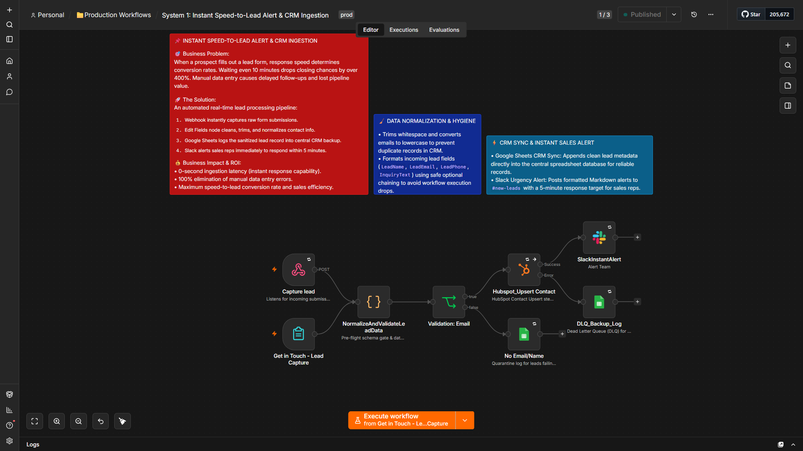
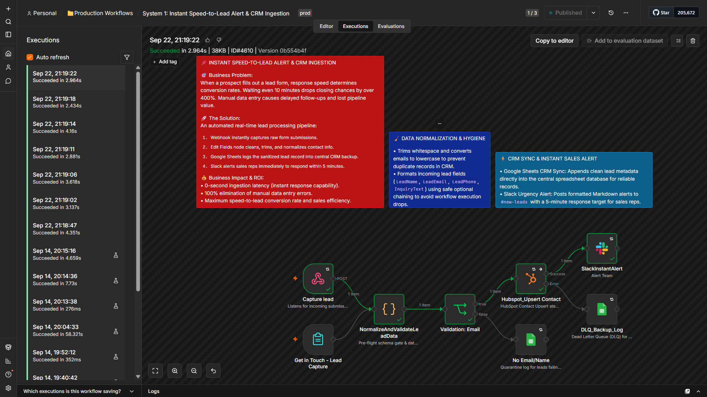
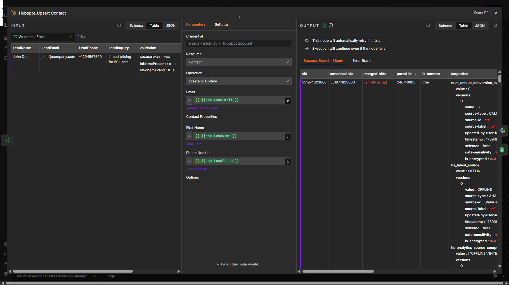
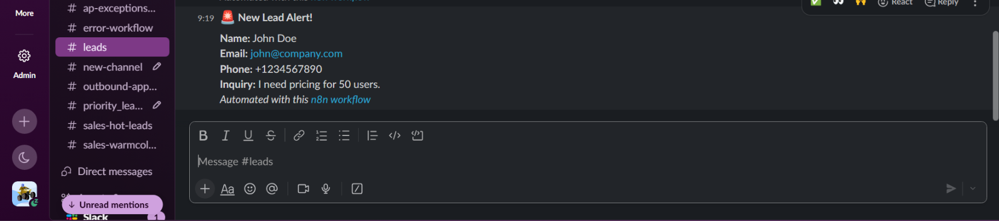

# 📌 Instant Speed-to-Lead Alert & CRM Ingestion Engine

Production-grade n8n pipeline that turns raw lead form submissions into clean CRM records and instant Slack sales alerts—so revenue teams contact high-intent buyers in seconds without losing leads or corrupting databases.

- 0-second lead ingestion latency to enforce a strict 5-minute sales response SLA
- 100% CRM data hygiene via pre-flight schema gates and automated contact normalization
- Zero-downtime fault tolerance with automatic retries and Dead Letter Queue (DLQ) failover vault

**Stack:** n8n + Webhooks + HubSpot API + Google Sheets (DLQ & Quarantine) + Slack API

---

[](https://www.loom.com/share/707c78cf35df44a4adf3ee1a04d75b57)



An automated, fault-tolerant lead processing engine built with **n8n**, **Webhooks**, **HubSpot API**, **Google Sheets**, and **Slack**.

> 🎬 **Video Demo:** Watch the full architecture and fail-safe walkthrough on [Loom](https://www.loom.com/share/707c78cf35df44a4adf3ee1a04d75b57).

---

## 🎯 Business Problem

When a prospective buyer fills out an inquiry form, response speed dictates conversion rate. Studies show that waiting even 10 minutes to follow up drops closing rates by over 400%. Manual data entry, unvalidated contact payloads, and silent API drops cause corrupt CRM databases, missed SLAs, and lost pipeline revenue.

## 🚀 Solution Overview

This production-grade n8n workflow automates end-to-end lead ingestion while enforcing complete data integrity:

1. **Ingest & Validate (`NormalizeAndValidateLeadData`):** Webhook captures POST payloads instantly; pre-flight schema gate trims whitespace, lowercases emails, and validates email/name format.
2. **Quarantine Routing (`No Email/Name`):** Isolates malformed or incomplete inquiries into a dedicated Google Sheets log (`SKIPPED_INVALID_SCHEMA`) without crashing execution.
3. **HubSpot CRM Sync (`Hubspot_Upsert Contact`):** Upserts contact records using `LeadEmail` as the unique lookup key, backed by 3x auto-retries (5s wait).
4. **Dead Letter Queue (`DLQ_Backup_Log`):** Traps 4xx/5xx API drops from HubSpot or Slack, logging node name, error message, timestamp, and execution ID for zero data loss.
5. **Instant Sales Alert (`SlackInstantAlert`):** Pushes formatted Markdown alerts to `#new-leads` enforcing a target 5-minute sales response window.

## 💰 Business Impact & ROI

* **⚡ 0-Second Lead Ingestion:** Eliminates response latency completely, enabling reps to hit leads while buy-intent is at its peak.
* **🔒 100% CRM Data Hygiene:** Pre-flight schema validation blocks missing emails, uncleaned names, and duplicate records at the door.
* **🛡️ Zero-Data-Loss Vault:** Dead Letter Queue (DLQ) captures third-party API drops and network timeouts so no prospect payload is lost.

---

## 🧪 Live Execution Proof & Verification

### 1. Workflow Execution History

*Figure 1: Verified n8n execution log confirming 0-second ingestion latency across all pipeline nodes.*

### 2. HubSpot Contact Upsert Payload

*Figure 2: Verified sanitized lead contact payload synced directly into HubSpot CRM.*

### 3. Real-Time Slack Sales Alert

*Figure 3: Formatted markdown alert pushed instantly to `#new-leads` for sales follow-up.*

---

## ⚙️ How to Deploy & Setup

### 1. Import Blueprint
1. Copy the workflow JSON from the repository.
2. Open your n8n instance, click **Workflows** -> **Import from File / JSON**, and paste the blueprint.

### 2. Configure Credentials & Connections
* **Webhook Trigger:** Set path to `capture-lead` (HTTP Method: `POST`).
* **HubSpot API:** Connect your HubSpot OAuth2 / Access Token credential for contact upserts.
* **Google Sheets (DLQ & Quarantine):** Select target Spreadsheet ID for `DLQ_Backup_Log` and `No Email/Name` quarantine logs.
* **Slack API:** Connect Slack OAuth2 credential and set channel target to `#new-leads`.

### 3. Test Payload Execution
Send a test POST request to your webhook endpoint:

```json
{
  "LeadName": "John Doe",
  "LeadEmail": "john.doe@example.com",
  "LeadPhone": "+1234567890",
  "LeadInquiry": "Interested in enterprise automation pipeline."
}
```

---
📈 Engineering Roadmap & Milestone
Roadmap Phase: Phase 2 (Automation Engineering)

Sprint Tracker: Sprint 2 — API Integration & Error Workflows

Build Milestone: Completed (Day 42/153)
